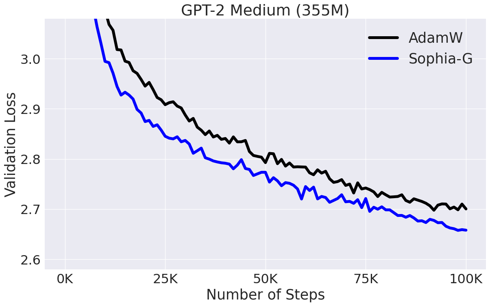

# Sophia: A Scalable Stochastic Second-order Optimizer for Language Model Pre-training


This is an official implementation of the **Sophia-G** optimizer in the paper [https://arxiv.org/abs/2305.14342](https://arxiv.org/abs/2305.14342) and GPT-2 training scripts. The code is based on [nanoGPT](https://github.com/karpathy/nanoGPT/). Please cite the paper and star this repo if you find Sophia useful. Thanks!


```tex
@article{liu2023sophia,
 title={Sophia: A Scalable Stochastic Second-order Optimizer for Language Model Pre-training},
 author={Liu, Hong and Li, Zhiyuan and Hall, David and Liang, Percy and Ma, Tengyu},
 journal={arXiv preprint arXiv:2305.14342},
 year={2023}
}
```


## News and Updates
- :fire: :fire: Training script released for GPT2 Medium (355M).
- :fire: Watch Sophia running on GPT2 Small (125M) in the [wandb report](https://api.wandb.ai/links/hliu99/rs9tp0rb).

- We will spend more resources on scaling up to larger models. Please feel free to let us know if you have any feedback or interesting findings from using Sophia.


- For Large (770M), please see the hyperparameters we used to produce the results in the paper below in the hyperparameter tuning. The scripts will be released soon (potentially with an improved choice of hyperparameters that we are currently experimenting with.)
- The JAX version of Sophia-H will be included at [levanter](https://github.com/stanford-crfm/levanter), which is also an amazing code base for language model pre-training.


## Dependencies


- [pytorch](https://pytorch.org) 2.0
- transformers
- datasets
- tiktoken
- wandb


## Usage (GPT-2 Pre-training)

Prepare the [OpenWebText](https://huggingface.co/datasets/openwebtext) data following [nanoGPT](https://github.com/karpathy/nanoGPT/):
```
$ python data/openwebtext/prepare.py
```
Start pre-training GPT2 Small (125M):

If you have a machine with 10 A5000 (24GB) GPUs,
```
$ torchrun --standalone --nproc_per_node=10 train_sophiag.py config/train_gpt2_small_sophiag.py --batch_size=8 --gradient_accumulation_steps=6
```
If you have a machine with 8 A100 (40GB) GPUs,
```
$ torchrun --standalone --nproc_per_node=8 train_sophiag.py config/train_gpt2_small_sophiag.py --batch_size=12 --gradient_accumulation_steps=5
```

To reproduce the AdamW baseline following [nanoGPT](https://github.com/karpathy/nanoGPT/):
```
$ torchrun --standalone --nproc_per_node=10 train_adam.py config/train_gpt2_small_adam.py --batch_size=8 --gradient_accumulation_steps=6
```

This will lead to results in the figure below:


Start pre-training GPT2 Medium (355M):

If you have a machine with 8 A100 (40GB) GPUs,
```
$ torchrun --standalone --nproc_per_node=8 train_sophiag.py config/train_gpt2_medium_sophiag.py --batch_size=6 --gradient_accumulation_steps=10
```

To reproduce the AdamW baseline:
```
$ torchrun --standalone --nproc_per_node=8 train_adam.py config/train_gpt2_medium_adam.py --batch_size=6 --gradient_accumulation_steps=10
```

Please adjust ```nproc_per_node```, ```batch_size```, and ```gradient_accumulation_steps``` accordingly if you use other hardware setup. Make sure their product equals 480.


This will lead to results in the figure below:



## General Usage


```python
import torch
from torch import nn
from sophia import SophiaG


#init model loss function and input data
model = Model()
data_loader = ...


#init the optimizer
optimizer = SophiaG(model.parameters(), lr=2e-4, betas=(0.965, 0.99), rho = 0.01, weight_decay=1e-1)


k = 10
iter_num = 0
#training loop
for epoch in range(epochs):
   for X,Y in data_loader:
       if iter_num % k != k - 1:
           # standard training code
           logits, loss = model(X, Y)
           loss.backward()
           optimizer.step(bs=4096)
           optimizer.zero_grad(set_to_none=True)
           iter_num += 1
       else:
           # standard training code
           logits, loss = model(X, Y)
           loss.backward()
           optimizer.step(bs=4096)
           optimizer.zero_grad(set_to_none=True)
           iter_num += 1
           # update hessian EMA
           logits = model(X, None)
           samp_dist = torch.distributions.Categorical(logits=logits)
           y_sample = samp_dist.sample()
           loss_sampled = cross_entropy(logits, y_sample)
           loss_sampled.backward()
           optimizer.update_hessian()
           optimizer.zero_grad(set_to_none=True)
          
```


## Hyper-parameter Tuning

Definition of learning rate 
- The update in the code is written as $\theta_{t+1} = \theta_t - lr*\textup{clip}(m_t / (\rho * h_t + \epsilon), 1)$, which is equivalent to the update in the paper up to a re-parameterization. (the $lr$ here corresponds to $\rho \cdot \eta_t$ in the paper). 


Some tips for tuning hyperparameters (based on our limited tuning):  
- Choose lr to be about the same as the learning rate that you would use for AdamW. Some partial ongoing results indicate that lr can be made even larger, possibly leading to a faster convergence.

- Consider choosing $\rho$ in $[0.01, 0.1]$. $\rho$ seems transferable across different model sizes. We choose rho = 0.03 in 125M Sophia-G.
The (lr, rho) for 355M, Sophia-G is chosen to be (5e-4,0.05) (more aggressive and therefore, even faster! :rocket: :rocket:). Slightly increasing weight decay seems also helpful.

- Please feel free to let us know what you find out during hyper-parameters tuning. We appreciate your valuable feedback and comments!


## Acknowledgement


The GPT-2 training code is based on [nanoGPT](https://github.com/karpathy/nanoGPT/), which is elegant and super efficient.