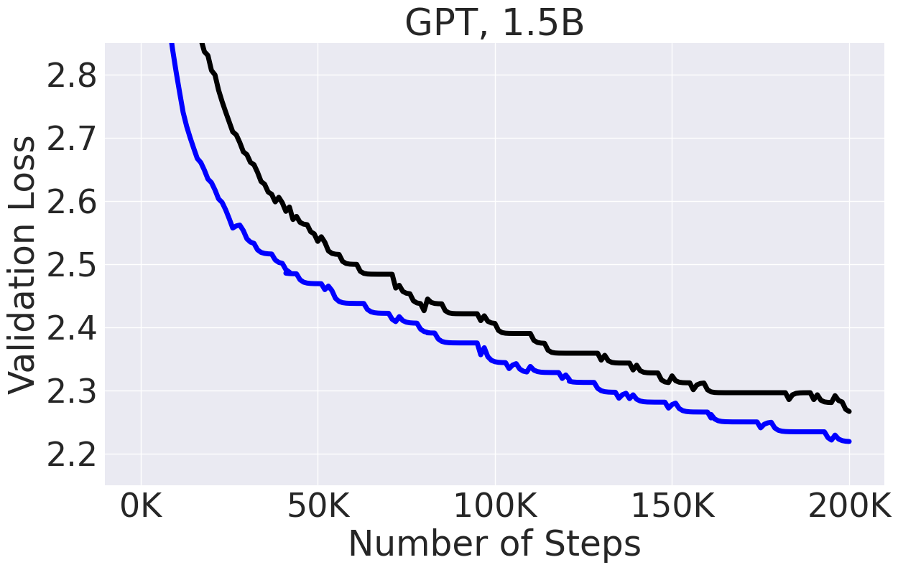
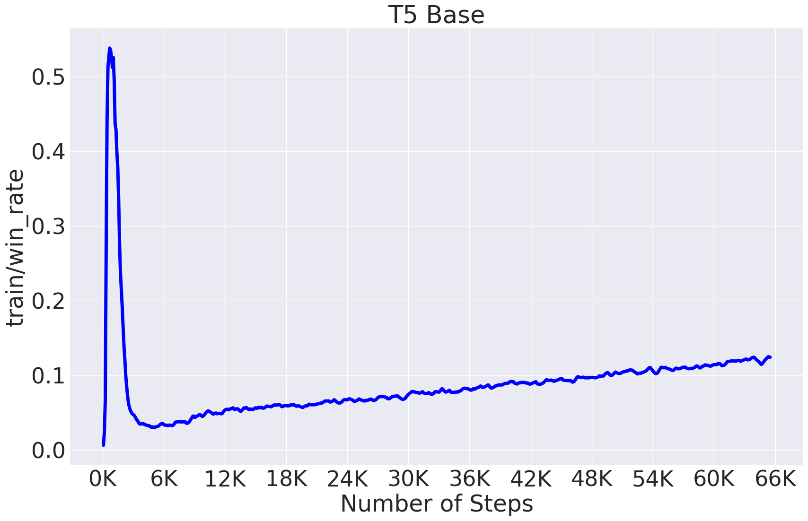

# Sophia: A Scalable Stochastic Second-order Optimizer for Language Model Pre-training


This is an official implementation of the **Sophia-G** optimizer in the paper [https://arxiv.org/abs/2305.14342](https://arxiv.org/abs/2305.14342) and GPT-2 training scripts. The code is based on [nanoGPT](https://github.com/karpathy/nanoGPT/) and [levanter](https://github.com/stanford-crfm/levanter/). Please cite the paper and star this repo if you find Sophia useful. Thanks!


```tex
@article{liu2023sophia,
 title={Sophia: A Scalable Stochastic Second-order Optimizer for Language Model Pre-training},
 author={Liu, Hong and Li, Zhiyuan and Hall, David and Liang, Percy and Ma, Tengyu},
 journal={arXiv preprint arXiv:2305.14342},
 year={2023}
}
```


## News and Updates
- :fire: :fire: [Training script](https://github.com/stanford-crfm/levanter/tree/e183ec80ec5971b12d4a3fb08a160268de342670) and results released for GPT2 1.5B.
<p align="center" width="100%">
      
</p>


## Dependencies


- [pytorch](https://pytorch.org) 2.0
- transformers
- datasets
- tiktoken
- wandb

## General Usage

Below is an example code snippet for training a general model with NLL loss with SophiaG. Please refer to the next section for guidelines on hyperparameter tuning.

```python
import torch
import torch.nn.functional as F
from sophia import SophiaG

# init model loss function and input data
model = Model()
data_loader = ...

# init the optimizer
optimizer = SophiaG(model.parameters(), lr=2e-4, betas=(0.965, 0.99), rho=0.01, weight_decay=1e-1)

total_bs = len(data_loader)
bs = total_bs * block_size
k = 10
iter_num = -1

# training loop
for epoch in range(epochs):
    for X, Y in data_loader:
        # standard training code
        logits, loss = model(X, Y)
        loss.backward()
        optimizer.step(bs=bs)
        optimizer.zero_grad(set_to_none=True)
        iter_num += 1

        if iter_num % k != k - 1:
            continue
        else:
            # update hessian EMA
            logits, _ = model(X, None)
            samp_dist = torch.distributions.Categorical(logits=logits)
            y_sample = samp_dist.sample()
            loss_sampled = F.cross_entropy(logits.view(-1, logits.size(-1)), y_sample.view(-1), ignore_index=-1)
            loss_sampled.backward()
            optimizer.update_hessian()
            optimizer.zero_grad(set_to_none=True)
            model.zero_grad()
```


## Hyper-parameter Tuning

### Definition of learning rate 
- The update in the code is written as $\theta_{t+1} = \theta_t - lr*\textup{clip}(m_t / (\rho * h_t + \epsilon), 1)$, which is equivalent to the update in the paper up to a re-parameterization. (the $lr$ here corresponds to $\rho \cdot \eta_t$ in the paper). 

- The learning rate of AdamW and Lion is not directly comparable. Empirically, Adam and Lion with learning rate ratio 5:1 has similar behaviour. The learning rate of SophiaG and Lion is directly comparable. Sophia allows to use much larger learning rate the Lion, and this is why Sophia is much faster. 

### General models
- Choose lr to be slightly smaller than the learning rate that you would use for AdamW or 3 - 5 times the learning rate that you would use for Lion. 
- Tune $\rho$ to make the proportion of the clipped coordinates stable and in a proper range. This is tracked as ```train/win_rate``` in the [GPT-2 training example](https://github.com/Liuhong99/Sophia/blob/2443b03529ecdccf65699a5e55e68d69ede39509/train_sophiag.py#L398C21-L398C65). ```train/win_rate``` should peak in the beginning and remain stable afterwards. ```train/win_rate``` should stay in the range of 0.1 - 0.5. Typically a large $\rho$ will lead to a large ```train/win_rate```. An example of typical ```win_rate``` behavior in T5 model is provided below. <p align="center" width="100%">
      
</p>

- If the loss blows up, slightly decrease the learning rate or increase $\rho$.
  
- Always use about 2x larger weight decay than what you would use for AdamW.

### GPT-2 models

- Choose lr to be about the same as the learning rate that you would use for AdamW or 5 - 10 times the learning rate that you would use for Lion.
- Tune $\rho$ to make the proportion of the parameters where the update is not clipped stable and in a proper range. This is tracked as ```train/win_rate``` in the [GPT-2 training example](https://github.com/Liuhong99/Sophia/blob/2443b03529ecdccf65699a5e55e68d69ede39509/train_sophiag.py#L398C21-L398C65). ```train/win_rate``` should peak in the beginning and remain stable afterwards. ```train/win_rate``` should stay in the range of 0.1 - 0.5. Typically a large $\rho$ will lead to a large ```train/win_rate```.
- Use slightly larger weight decay than AdamW, e.g. 0.2.
- Except learning rate, all other hyperparameters are transferable across different model sizes.
- See the table below for the hyperparameters for different model sizes.

| Model Size  | lr for Adam | lr for Lion | lr for Sophia | $\rho$ for Sophia | weight decay for Sophia |
| -------- | ------- | ------- | ------- | ------- | ------- |
| 125M | 6e-4 | 1e-4 | 6e-4 | 0.05 | 0.2 |
| 355M | 3e-4 | 1e-4 | 5e-4 | 0.05 | 0.2 |
| 770M | 2e-4 | 8e-5 | 3e-4 | 0.05 | 0.2 |

- Please feel free to let us know what you find out during hyper-parameters tuning. We appreciate your valuable feedback and comments!

## Reproduce GPT-2 Results

Prepare the [OpenWebText](https://huggingface.co/datasets/openwebtext) data following [nanoGPT](https://github.com/karpathy/nanoGPT/):
```
$ python data/openwebtext/prepare.py
```
Start pre-training GPT2 Small (125M):

If you have a machine with 10 A5000 (24GB) GPUs,
```
$ torchrun --standalone --nproc_per_node=10 train_sophiag.py config/train_gpt2_small_sophiag.py --batch_size=8 --gradient_accumulation_steps=6
```
If you have a machine with 8 A100 (40GB) GPUs,
```
$ torchrun --standalone --nproc_per_node=8 train_sophiag.py config/train_gpt2_small_sophiag.py --batch_size=12 --gradient_accumulation_steps=5
```

To reproduce the AdamW baseline following [nanoGPT](https://github.com/karpathy/nanoGPT/):
```
$ torchrun --standalone --nproc_per_node=10 train_adam.py config/train_gpt2_small_adam.py --batch_size=8 --gradient_accumulation_steps=6
```

This will lead to results in the figure below:
<p align="center" width="100%">
      
</p>

Start pre-training GPT2 Medium (355M):

If you have a machine with 8 A100 (40GB) GPUs,
```
$ torchrun --standalone --nproc_per_node=8 train_sophiag.py config/train_gpt2_medium_sophiag.py --batch_size=6 --gradient_accumulation_steps=10
```

To reproduce the AdamW baseline:
```
$ torchrun --standalone --nproc_per_node=8 train_adam.py config/train_gpt2_medium_adam.py --batch_size=6 --gradient_accumulation_steps=10
```

Please adjust ```nproc_per_node```, ```batch_size```, and ```gradient_accumulation_steps``` accordingly if you use other hardware setup. Make sure their product equals 480.


This will lead to results in the figure below:
<p align="center" width="100%">
      
</p>

Start pre-training GPT2 1.5B:

We use [the Pile](https://github.com/EleutherAI/the-pile) and GPT NeoX tokenizer. First set up TPU instances and environment following [levanter](https://github.com/stanford-crfm/levanter/blob/e183ec80ec5971b12d4a3fb08a160268de342670/docs/Getting-Started-TPU-VM.md). Then change GAMMA_SOPHIA_G to 200 in [optim.py](https://github.com/stanford-crfm/levanter/blob/e183ec80ec5971b12d4a3fb08a160268de342670/src/levanter/optim.py). The training script for 1.5B model is 
```
gcloud compute tpus tpu-vm ssh <instance_name> --zone <zone_name> --worker=all --command 'WANDB_API_KEY=<wandb_api_key> levanter/infra/launch.sh python levanter/examples/gpt2_example.py --config_path levanter/config/gpt2_1536_pile.yaml --trainer.beta1 0.965 --trainer.beta2 0.99 --trainer.min_lr_ratio 0.020 --trainer.weight_decay 0.15 --trainer.learning_rate 2.5e-4 --trainer.warmup_ratio 0.01'

```

## Acknowledgement

The GPT-2 training code is based on [nanoGPT](https://github.com/karpathy/nanoGPT/), which is elegant and super efficient.