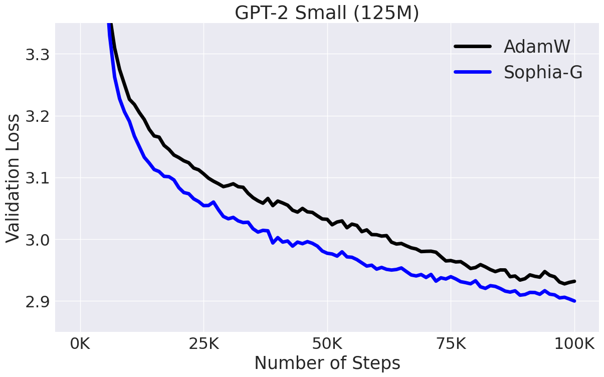

# Sophia: A Scalable Stochastic Second-order Optimizer for Language Model Pre-training

This is an official implementation of **Sophia-G** and GPT-2 training scripts based on [nanoGPT](https://github.com/karpathy/nanoGPT/). See the paper [here](https://arxiv.org/abs/2305.14342). Please cite the paper and star this repo if you find Sophia useful. Thanks!

```tex
@article{liu2023sophia,
  title={Sophia: A Scalable Stochastic Second-order Optimizer for Language Model Pre-training},
  author={Liu, Hong and Li, Zhiyuan and Hall, David and Liang, Percy and Ma, Tengyu},
  journal={arXiv preprint arXiv:2305.14342},
  year={2023}
}
```

## News and Updates

- We will spend more resources on scaling up to larger models. Please let us know if you have any feedbacks or findings when using Sophia.
- The training script for Middle (355M) and Large (770M) will be released soon. 
- The JAX version of Sophia-H will be included at [levanter](https://github.com/stanford-crfm/levanter), which is also an amazing code base for language model pre-training. 

## Dependencies

- [pytorch](https://pytorch.org) 2.0
- transformers
- datasets
- tiktoken 
- wandb 

## Usage (GPT-2 Pre-training)

Prepare the [OpenWebText](https://huggingface.co/datasets/openwebtext) data following [nanoGPT](https://github.com/karpathy/nanoGPT/):
```
$ python data/openwebtext/prepare.py
```
Start pre-training GPT2 Small (125M):

If you have a machine with 10 A5000 (24GB) GPUs,
```
$ torchrun --standalone --nproc_per_node=10 train_sophiag.py config/train_gpt2_small_sophiag.py --batch_size=8 --gradient_accumulation_steps=6
```
If you have a machine with 8 A100 (40GB) GPUs,
```
$ torchrun --standalone --nproc_per_node=8 train_sophiag.py config/train_gpt2_small_sophiag.py --batch_size=12 --gradient_accumulation_steps=5
```

To reproduce the AdamW baseline following [nanoGPT](https://github.com/karpathy/nanoGPT/):
```
$ torchrun --standalone --nproc_per_node=10 train_adam.py config/train_gpt2_small_adam.py --batch_size=8 --gradient_accumulation_steps=6
```

Please adjust ```nproc_per_node```, ```batch_size```, and ```gradient_accumulation_steps``` accordingly if you use other hardware setup. Make sure their product equals 480.

This will lead to results in the figure below:



## General Usage

```python 
import torch 
from torch import nn
from sophia import SophiaG

#init model loss function and input data
model = Model()
loss_function = nn.CrossEntropy()
data_loader = ...

#init the optimizer
optimizer = SophiaG(model.parameters(), lr=2e-8, betas=(0.965, 0.99), gamma = 2e4, weight_decay=1e-1)

k = 10
iter_num = 0
#training loop
for epoch in range(epochs):
    for X,Y in data_loader:
        if iter_num % k != k - 1:
            # standard training code
            logits, loss = model(X, Y)
            loss.backward()
            optimizer.step()
            optimizer.zero_grad(set_to_none=True)
            iter_num += 1
        else:
            # standard training code
            logits, loss = model(X, Y)
            loss.backward()
            optimizer.step()
            optimizer.zero_grad(set_to_none=True)
            iter_num += 1
            # update hessian EMA
            logits = model(X, None)
            samp_dist = torch.distributions.Categorical(logits=logits)
            y_sample = samp_dist.sample()
            loss_sampled = cross_entropy(logits, y_sample)
            loss_sampled.backward()
            optimizer.update_hessian()
            optimizer.zero_grad(set_to_none=True)
            
```

## Hyper-parameter Tuning

- While we are still working on tuning hyper-parameters, one suggestion learned from current experiments is to choose $\rho$ in $[0.01, 0.1]$. $\rho$ seems transferable across different model sizes. 
- Another important thing is to set $\rho\times$ LR to about $1/2 \times$ the LR you would use for AdamW. Some partial results indicate this can even be made larger, leading to faste convergence. 
- Please let us know what you find out when tuning hyper-parameters. We appreciate your valuable feedbacks and comments!


## Acknowledgement

The GPT-2 training code is based on [nanoGPT](https://github.com/karpathy/nanoGPT/), which is elegent and super efficient. 